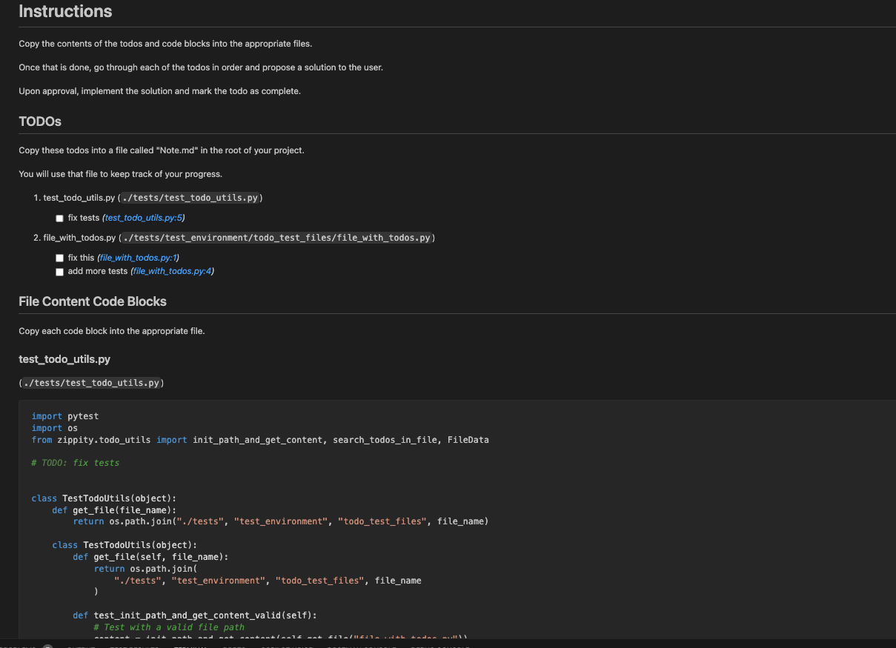

# Zippity

[](https://badge.fury.io/py/zippity=pi)
[](https://codecov.io/gh/lumpenspace/zippity)
[](https://zippity-pi.readthedocs.io/en/latest/?badge=latest)
[](https://opensource.org/licenses/MIT)

 dum lil CLI to collect TODOs for ChatGPT

## Warns

I'm currently preparing the companion GPT; you are welcome to use it in the meantime but it's going to be disappointing.


## Installation

```shell
pipx install zippity_py
```

## Usage

After installation, you can use the CLI by running:

```bash


> zpt --help

Usage: zpt [OPTIONS] [SOURCE_DIRECTORY]

Options:
  -e, --extensions TEXT (Default: '.py,.js,.ts')
  -r, --result_file PATH  (Default: 'ZIPPITYDO_EXAMPLE.md')
  -t, --template_file PATH
  --help    
```

## Template

Templates are jinja markdown files, that get passed an list of these:

```python
FileTodos = TypedDict(
    "FileTodos",
    {
        "todos": List[Todo],
        "content": str,
        "language": str,
        "mimetype": str,
        "name": str,
    },
)
```

Each `FileTodo` will have a list of todos, like this:

```python
Todo = TypedDict(
    "Todo",
    {
        "line_number": int,
        "text": str,
    },
)
```

The default template is in [template/template.md](zippity/template/default.md.jinja); once compiled it looks like this:



## Contributing

Contributions are welcome. Please make sure to update tests as appropriate.

## License

[MIT](https://choosealicense.com/licenses/mit/)
